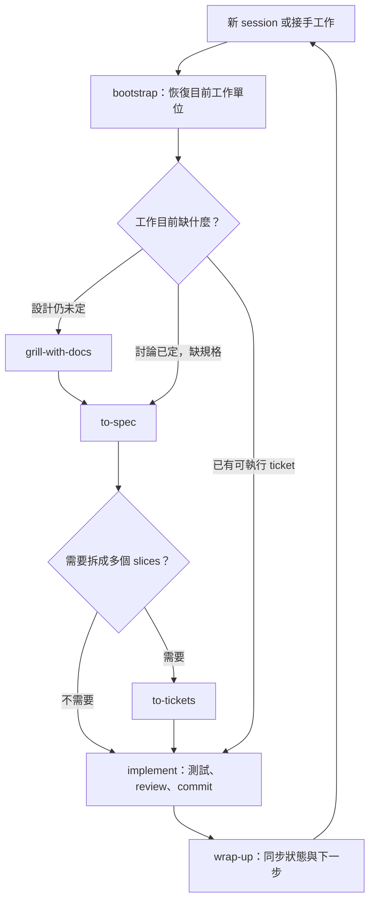

# bootstrap／wrap-up 與 Matt Pocock 工作流程分析

分析日期：2026-09-13。`warp-up` 依前文視為 `wrap-up`。

**建議保留 bootstrap 與 wrap-up，改善讀取範圍及資訊層級；不要用它們取代需求澄清、規格、ticket、實作或 code review。** 它們解決跨 session 延續，原作者流程解決功能如何形成與交付，兩者可以組合。

本次交付為分析與待確認的 implementation plan，未修改、安裝或發布 skill。以目前本機版本為修改基準，使用者提供的五個 workflow skill 為主要比較文本，並於分析日查閱上游。上游 main 會變動，本機與上游不假定逐字相同。

## 1. 證據與方法

依兩份指定指引分析：

- `writing-for-agents`：context pointer、context load／cognitive load、progressive disclosure、co-location、可檢查且完整的完成條件、單一權威來源、正向輸出契約。
- `superpowers:writing-skills`：description 聚焦觸發條件、依失敗類型選指令形式、無 skill／現版／候選版對照、RED–GREEN–REFACTOR、先測再改。

**已量測**：本機文件的字元、空白分隔詞、行數與 SHA-256。**已觀察**：本文引用的指令與目錄結構。**推論**：可能的過度探索、停頓、重複讀取與規格漂移。**未執行**：agent 行為壓力測試、跨模型比較、實際 token 與時間 benchmark；因此不宣稱某方案已節省特定比例 token，或現版一定會失敗。

兩份指引有取向差異。`writing-for-agents` 偏好正向描述，`writing-skills` 則允許對已觀察到的紀律違反使用禁止條款；本案採「輸出形狀與讀取範圍用正向契約，計畫保真及 Git 授權保留必要硬性規則」。字數建議是優化方向，不能為了達標刪掉有效保護。

## 2. Context 成本：問題不只在 skill 長度

以下計數包含 frontmatter，以非空白字串計為一詞，不等於模型 tokenizer 的 token。

| 本機 skill | 空白分隔詞 | 字元 | description 字元 |
|---|---:|---:|---:|
| bootstrap | 1,323 | 9,388 | 444 |
| wrap-up | 2,440 | 17,251 | 607 |
| handoff | 138 | 910 | 86 |
| grill-with-docs | 35 | 254 | 106 |
| to-spec | 493 | 3,118 | 151 |
| to-tickets | 894 | 5,768 | 247 |
| implement | 70 | 448 | 62 |
| code-review | 1,064 | 6,646 | 421 |

bootstrap 與 wrap-up 主檔合計 **3,763 詞**。這不能直接與整條 workflow 的執行成本比較：兩者常分別在不同 session 執行，而原作者短入口會載入依賴。以本機文件大小示意，grill-with-docs 加 grilling、domain-modeling 已達 847 詞；implement 加 tdd、code-review 達 1,693 詞，還未計入延伸參考、專案內容、工具輸出或 review subagents。這些加總僅說明依賴成本，並非每次必然全部載入。

應分開衡量四種成本：

1. **目錄成本**：被平台提供給模型的 description。兩個自訂 skill 都可 model-invoke，description 合計 1,051 字元；是否每 turn 重送、快取或省略，取決於實際 runtime，不能從 Markdown 推定帳單。
2. **分支載入成本**：主檔與真正載入的附屬文件。拆檔後若仍全部讀取，沒有實質節省。
3. **探索成本**：Git 輸出、文件、程式碼、測試與 tracker 內容。這很可能大於 skill 本身，需實測。
4. **接續成本**：下一個 agent 重複探索、追問、重做或誤判造成的成本。有效 handoff 即使增加少量文字，仍可能降低整個 session 交接週期的成本。

優化目標應是「在接續正確率不下降的前提下，減少整個交接週期的必要 context」，不能只以最短 SKILL.md 決勝。

## 3. 現版值得保留的設計

- **跨平台權威文件**：文件由專案擁有，延續既有來源，避免每換一個 AI 就建立另一套狀態文件。
- **證據分類**：計畫、已實作、已檢查與歷史檢查結果分開，避免交接時把推論升級為完成事實。
- **bootstrap 的唯讀階段與後續任務分界**：單獨呼叫只產生 brief；已有後續指令則接續，減少多餘確認。
- **Plan Fidelity**：只保存可取得、明確確認的原文；正文與進度分離，保留來源與逐字比對。
- **發布分離**：default、ncp、plan 不 commit／push；publish 才進入發布檢查，維持混合工作樹的範圍控制。
- **可選 project context**：沒有設定也能探索，適合個人跨專案使用。

這些能力不是原作者短 workflow 入口自動提供的。作者經驗使其設計值得參考，但本機專案、runtime 與中斷方式是否適合，仍要由行為測試判定。

## 4. 依優先度整理的改善項目

### P1：bootstrap 要有依任務停止探索的條件

**文字依據**：bootstrap 第 2 節要求先讀列出的 status、handoff、plan、spec、decision；第 3 節要求入口、設定、架構與命令；第 6 節要求十類 brief 內容。第 4 節已有 targeted discovery，但沒有明確判斷「讀到這裡就夠」的條件。

**影響推論**：只接 ticket 7 也可能閱讀整個計畫與全專案背景，最後再輸出一次摘要。縮短最後回覆並不能收回前面已載入的內容。

**建議**：先識別目前的工作單位。先讀適用指令、權威路由、最小 Git 狀態、目前交接與該工作單位；只有驗收、依賴、衝突或入口位置仍缺失才擴讀。停止條件為：已知任務身分、規範來源、驗收條件、相關工作樹變更、阻塞及下一個具體動作，或明確標示欠缺的必要資料。沒有後續任務時，建立精簡概覽並推薦下一步即可。

### P1：把「目前實作」與「應有行為」分開處理

**文字依據**：bootstrap 第 5 節的單一優先序把 observable source／tests 放在 accepted decisions／specifications 前面；wrap-up 依現況同步所有受影響文件。

**影響推論**：程式與已接受規格不同時，agent 可能把尚未完成或有 bug 的程式當成新要求。原文雖要求辨識 planned／implemented，仍應明確限制此優先序的用途。

**建議**：使用者指令與適用規範維持優先；live state 判定「現在是什麼」，已接受規格判定「應該是什麼」。兩者不一致記為實作落差或未決變更，取得決策依據後才能改寫需求。舊機器路徑則以當前環境修正事實，與設計意圖變更分開。

### P1：交接要能定位 ticket frontier

**文字依據**：bootstrap 要求 canonical plan 的正式 identifier 與原句；wrap-up 要求 next action，但兩者都未明確要求 ticket ID、blocking edges、review 基準。to-tickets 則明確以 blockers 全完成的 frontier 決定可做的工作。

**影響推論**：有完整 plan 仍可能選到被阻塞的 ticket；僅有 tickets 的專案可能被誤認為缺計畫。

**建議**：既有 plan 或 tracker 都可提供工作身分。交接只記目前／下一工作單位的穩定 ID、來源引用、阻塞狀態、下一步；相關時補 review fixed point 與待 review 變更範圍。plan 存在就保留其正式文字，ticket-only 專案則使用 ticket 原有 ID／標題，不創造一套編號。

### P2：主流程與選用分支拆開

**文字依據**：wrap-up 主檔同時有 config、Plan Fidelity、publish；兩個 skill 重複跨平台權威來源、config 路由與證據定義。

**建議**：主檔留下 mode 判定、共用步驟、完成契約；Plan Fidelity、publish、設定細節各以可觀察的條件載入。精簡且共用的證據／權威來源規則可集中到普通參考文件，由兩者明確引用。

拆分不應把必要停止條件藏起來。相鄰的定義、條件與例外一起移動。共用文件新增安裝相依性，必須測試兩個 skill 一起安裝及單獨安裝；缺檔不能靜默忽略。先以實測判斷集中一份是否優於兩份極短契約。

### P2：縮短 description 並收窄誤觸範圍

**文字依據**：bootstrap description 混合要載入的項目與多個平台名稱；wrap-up description 同時敘述 mode 執行方式，長 607 字元。

**建議**：保留「恢復 session／接手下一項工作」與「階段收尾／保存確認計畫／同步交接」等獨立觸發分支，把命令語義放進正文。保留目前 model-invocation 能力；改成 user-only 會改變使用習慣，不應只為節省 description 自動改動。

需測 negative cases：比較兩個 skill、提到 plan、一般程式問題，都不應意外執行收尾。是否有過度觸發目前未實測。

### P2：交接與 brief 以結構保證完整，減少重述

**建議契約**：工作單位及來源 → 當前狀態與證據 → 已確認決策／待決問題 → 阻塞與下一步。已存在的完整 spec、plan、ADR 以引用為主；對話中新出現、尚未保存的限制、失敗尝試與理由才補入。

保留五個證據標籤，但「預期檢查」限於本次任務、repo 要求與實際計畫執行的檢查，不枚舉全專案所有可用命令。歷史通過記錄保留原命令、結果、revision／時間（已知時），在新 session 仍標 Observed，不宣稱本次 Verified。是否需重跑由影響範圍與 freshness 決定；發布必跑的檢查不能被省略。

### P2：讀取／寫回採不同契約，但共用事實定義

bootstrap 負責恢復可執行狀態；wrap-up 負責落檔與同步受影響資訊。兩者不必合成一個大 skill。受影響文件仍要同步，但可由目前工作單位、變更與引用關係界定範圍，而非每次重寫完整文件系統。

### 相容性議題：publish 與 feature branch

wrap-up 目前把 current branch 與 git.default_branch 不同視為發布阻塞，這可能與 implement「commit current branch」的習慣碰撞。這是明寫的保守政策，不能當成無用文字刪掉。本輪改善先保留它；若未來要改成允許 feature branch，必須獨立確認政策與測試，不能夾帶在 context 精簡裡。

## 5. 與原作者流程的互補、替代關係

| 原流程階段 | 解決什麼 | bootstrap／wrap-up 能否取代 |
|---|---|---|
| grill-with-docs | 澄清設計、建立術語與 ADR | 不能。恢復已知決策不會完成尚未進行的需求訪談。 |
| to-spec | 將討論形成需求、實作與測試決策 | 不能。保存原文或交接狀態不等於綜合需求規格。 |
| to-tickets | 拆成可驗收 slices 並建立 blocking edges | 不能。下一步文字不等於任務依賴圖。 |
| implement | 依 spec／tickets 實作並使用測試回饋 | 不能。bootstrap 可接續執行使用者已指示的任務，但實作紀律仍來自 implement／tdd。 |
| code-review | 分別檢查 Standards 與 Spec | 不能。wrap-up 的文件一致性、測試與 diff 檢查不涵蓋兩軸 review。 |

原作者的 implement 已要求完成後呼叫 code-review，再 commit。手動流程尾端再寫一次 code-review 可作為提醒，但不需要機械式重跑；若有新修改、不同比較範圍或獨立審查需求，才再執行。[上游 implement](https://github.com/mattpocock/skills/blob/main/skills/engineering/implement/SKILL.md)

另有一個上游介面落差：implement 要在 commit 前 review，而 code-review 使用 fixed-point...HEAD，可能漏掉尚未 commit 的本次變更。整合時必須明確記錄「要審哪批變更」與 fixed point；不能把 wrap-up 的檢查算作已審查。修正上游 review 指令是獨立範圍，本次僅記錄限制。[上游 code-review](https://github.com/mattpocock/skills/blob/main/skills/engineering/code-review/SKILL.md)

原作者另有 handoff，負責把對話壓縮成暫存文件，引用已有成果。這證明交接也是其工具集內的一個用途，但它沒有你這兩個 skill 的完整文件同步、現況重建與原文保真契約。[上游 handoff](https://github.com/mattpocock/skills/blob/main/skills/productivity/handoff/SKILL.md)

**可以被取代的部分**：人工重講背景、重找下一個任務、重建散落的 session 狀態。若已有完整且新鮮的 tracker／handoff 與唯讀載入機制，bootstrap 可以縮成薄入口；若只是短暫切換同機 session，handoff 可以替代一次正式 wrap-up。這不表示永久刪除兩個 skill。

**可以省略的步驟**：需求與 slices 已清楚的小修改可直接使用 spec／ticket 進入實作，無需每次重跑所有前段；這是依工作狀態省略，而非 bootstrap 替代了它們。

## 6. 建議實際用法

圖中 commit／review 仍須遵守實際授權、repo 政策與正確 diff 範圍。wrap-up 的不發布預設不會撤回 implement 已取得的 commit 指令，也不會把它擴大為 push 授權。

任一階段若要中斷，可以寫交接，再由新 session bootstrap 回到該階段。`wrap-up plan` 只在有明確確認的計畫原文且要保存時使用；一般 ticket 收尾用 `wrap-up`，不要為了交接硬造 plan。跨 session 保真與正在執行的進度分開維護。

## 7. 建議變更範圍與驗收方式

先調整 context 讀取停止條件、工作單位引用與輸出契約，再依量測抽離分支；保留命令名稱、default／ncp／plan／publish 語義、Plan Fidelity、跨平台規則、證據標籤與授權限制。不要新增多個 lite／full 命令，避免把文件成本轉成人的記憶負擔。

使用單一主要行為接縫：**既有專案與 session 結果 → wrap-up 交接 → 全新 session bootstrap → 正確接續同一個工作單位**。附加觀察 filesystem／Git 變更、plan 正文相等、權威來源選擇與 context 載入範圍。細部測試與施工順序見 [Implementation plan](./skill-continuity-implementation-plan.md)。

未測之前只能說「有明確的改善候選」，不能聲稱「已經更有效率」。若無 skill 或現版已在某個情境穩定通過，不應為了合理化修改而製造失敗；先保留有效行為。

## 8. 來源定位

本機基準：

- bootstrap：`C:/Users/User/.agents/skills/bootstrap/SKILL.md`，重點第 28、39、51、64、79、91 節起始行。
- wrap-up：`C:/Users/User/.agents/skills/wrap-up/SKILL.md`，重點第 23、42、54、77、88、103、113 節起始行。
- writing-for-agents：`C:/Users/User/.agents/skills/writing-for-agents/SKILL.md`，搭配 `SKILL-MECHANICS.md`。
- writing-skills：`C:/Users/User/.codex/plugins/cache/openai-curated-remote/superpowers/6.3.0/skills/writing-skills/SKILL.md`，搭配 `testing-skills-with-subagents.md` 與 TDD 背景。

遠端核對：

- [skills repository](https://github.com/mattpocock/skills)
- [grill-with-docs](https://github.com/mattpocock/skills/blob/main/skills/engineering/grill-with-docs/SKILL.md)
- [to-spec](https://github.com/mattpocock/skills/blob/main/skills/engineering/to-spec/SKILL.md)
- [to-tickets](https://github.com/mattpocock/skills/blob/main/skills/engineering/to-tickets/SKILL.md)

主檔 SHA-256：bootstrap `FD73C5DF76FA27B59AC276EB8768A7A478F6ADA367016A5123BF7C02D4D4C95B`；wrap-up `BED2C4B1302B12B14FF28DCD5E8A2F53C18A840FC095ED24548D999FC3753A1F`。
